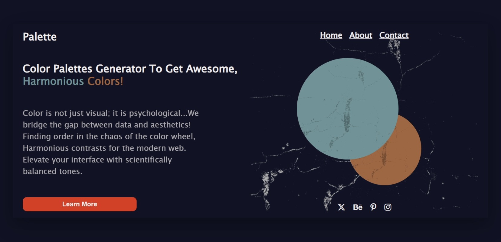

# 🎨 Palette - AI-Powered Color Palette Generator

An intelligent, interactive color palette generator that helps designers and developers create harmonious color schemes with ease. Built with vanilla JavaScript and powered by the Huemint AI API for professional-grade color combinations.

## 📸 Screenshots




## ✨ Features

- **AI-Driven Color Generation**: Leverages the Huemint API to generate professionally balanced color palettes
- **Smart Lock System**: Lock individual colors to preserve them while regenerating others
- **Live Color Picker**: Fine-tune any color manually with an integrated color picker (Pickr.js)
- **Real-Time Visualization**: Preview your palette on a live demo page that updates instantly
- **Intelligent Text Contrast**: Automatically adjusts text color (black/white) based on background luminance
- **One-Click Copy**: Copy hex codes to clipboard with visual feedback
- **Keyboard Shortcuts**: Press spacebar to generate new palettes quickly
- **Cross-Window Communication**: Live updates between generator and visualization using postMessage API
- **Fully Responsive**: Optimized layouts for mobile, tablet, and desktop devices

## 🚀 Live Demo

[**View Live Demo**](https://palettegenerator31.netlify.app/)

## 🛠️ Built With

- **HTML5** - Semantic markup and structure
- **CSS3** - Modern layouts with Grid, Flexbox, and responsive design
- **Vanilla JavaScript (ES6+)** - No frameworks, just clean, efficient code
- **[Huemint API](https://huemint.com)** - AI-powered color generation
- **[Pickr](https://github.com/Simonwep/pickr)** - Advanced color picker library
- **Font Awesome** - Icon library for UI elements

## 📋 How to Use

### Basic Usage
1. **Generate Palette**: Press the **Spacebar** or click the **🎨 Palette Button**
2. **Lock Colors**: Click the **🔒 Lock Icon** to preserve specific colors
3. **Custom Colors**: Click any **Hex Code** to open the color picker
4. **Copy Colors**: Click the **Duplicate Icon** to copy hex codes
5. **Visualize**: Click **Visualize 🌈** to see your palette in action on a demo page


## 🎨 Color Theory Implementation

The generator uses an **adjacency matrix** to define relationships between colors:
- `0` = Same color (no relationship)
- `30-45` = Moderate harmony (complementary colors)
- `75` = High contrast (accent colors)

This ensures palettes are both aesthetically pleasing and functionally diverse.


## 📂 Project Structure
```
palette-generator/
├── index.html          # Main palette generator page
├── demo.html           # Visualization demo page
├── style.css           # Generator styles
├── demo.css            # Demo page styles
├── script.js           # Main application logic
├── demo.js             # Demo page logic
├── assets/             # Images and icons
│   ├── duplicate.svg
│   ├── lock.svg
│   ├── lock-open-alt.svg
│   └── granite-highlight.webp
└── README.md
```

## 🙏 Acknowledgments

- [Huemint](https://huemint.com) for the amazing AI color generation API
- [Pickr](https://github.com/Simonwep/pickr) for the color picker component
- [Font Awesome](https://fontawesome.com) for the icon library

---

